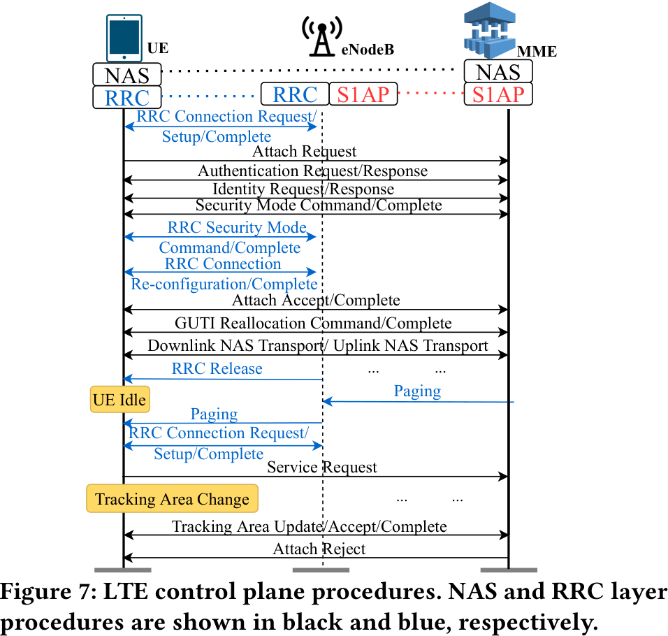
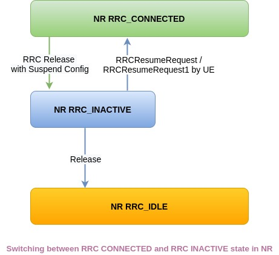

# LTE Control Plane Procedures

## Non-Access-Stratum Procedures (NAS)

This type of communication is performed with the Core Network (i.e. not with the Base station
directly, since it is the "middle-man" in the communication.

1. UE performs a radio setup procedure (after reboot).
2. RRC Connection Setup:
    - UE starts the NAS attach procedure by sending the `attach_request` message
    - UE performs `auth_request` with `auth_response` to setup authentication.
    - Mobility Managment Entity (MME) negotiates ciphering and integrity protection algorithms.
3. NAS security context is established between the UE and MME (integrity/encryption algorithms 
are now chosen)
4. MME sends the `attach_accept` message containing the GUTI: Globally Unique Temporary Identity
    - If something goes wrong, the MME sends a `attach_reject` message
5. The UE responds `attach_complete` to this message.

### Radio Resource Control Procedures (RRC)

This communication is related to the eNodeB/gNodeB and must therefore be performed with the RAN
component.

1. RRC Setup: RRC connection is created and NAS setup is performed
2. RRC security activation: 
    - The procedure is started with `RRC_sm_command` from the eNodeB
    - Completed with the `RRC_sm_complete` message from the UE
3. RRC release: when the phone disconnects, the network releases the radio bearers and suspends the
   RCC connection.
4. RRC connection reconfiguration: modify the RRC connection, establish/modify/release radio
   bearers.
    - UE completes the initial attach after this message

