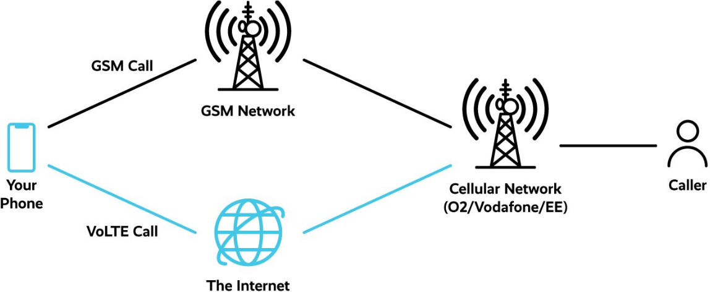

# How To Hack Shannon (from A phone)

## Attack Surface 

- Attacker performs attack to a registered phone
- The attack is via signaling fully remotely

### Analogy between VoLTE to WebRTC

- Call establishment is similar to sesison setup via a STUN/TURN server
- The same principles apply for VoLTE establishment

#### What attack surface can be used with VoLTE?

- There is a lot of protocols that are:
    - (a) either implemented directly on the baseband for speed
    - (b) implemented in userspace (because the developers think it is too unstable on the baseband)

#### Methodology

1. Extract a memdump from a phone (cf. "A walk with Shannon")
2. Find SIP/SDP/RTP/H264 drivers in the baseband
    - Can be located by doing string search or magic value search
3. Fuzz the task from a baseband crash
    - Builds on the work of [BaseSAFE](../re-hosting/baseSAFE.md): buffer based bugs (sanitization) found 

#### Real-world attack

- Find a phone where SDP/SIP/... lives in userland
- Root the phone and replace the functionality by patching the binary
- Send exploits on VoLTE setup (zero-click)

#### Filtering

- Some protocols are filtered/processed by the core network
    - SIP/SDP
- Other protocols are left unprocessed
    - RTP/H264
- Unfiltered ones are not "zero-click"

## Evaluation

- Modems can be compromised with enough effort
- Bug-rich environment
- Lack of tooling was a major barrier
- Fully-remote baseband attacks are a possibility
- Shannon mitigations have improved, but are still lacking
    - ASLR
    - Heap hardening
