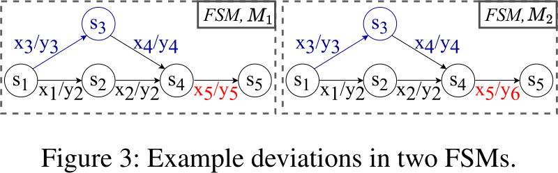

# 5G BaseChecker

## Motivation

- It is hard to build and implement secure 5G modems:
    - Extensive volume and ambiguities of the specification
- Analyzing basebands is also hard to do manually
    - Idea: automated reasoning about security and privacy of 5G baseband implementations

- **Critical Observation**: The 3GPP does not release a reference state machine for the protocol
    - It is necessary to create a manual oracle that decides the correctness of an implementation

## Approach

- `5GBaseChecker` uses automata learning and differential testing to construct a state machine for a vendor
- This state machine should then be used against all vendors, regardless of the implementation
    - Reason: black-box testing: no insight into the baseband given
    - Advantage: Flexible use against different vendors without additional effort
-  However, using the specification is unviable:
    1. Hard to parse with algorithms (formatting, natural language must be interpreted, ...)
    2. A lot of manual work, as there are many exceptions to catch (cf. BaseSpec, BaseCOMP)

### Differential Testing: Illustrating Example

1. Learn the behavior of a MTK modem and create a state machine
2. Learn the behavior of a Shannon/Qualcomm/... modem and create a new state machine
3. Probe the state machines to find differences between the FSMs

- Reasoning: either one of the FSMs has an implementation error, or both
    - Since the protocol state machine is analyzed, a deviation corresponds to a functional difference (true positive)

### Automata Learning: 'StateSyth'

- Two stages of automata learning:
    1. Passive learning: build a first model out of a series of messages
    2. Refine the model with an active learning approach: validate and extend the existing model
        - This way the first FSM for vendor $x$ is the baseline and then changed according to *counter examples* 

- **Problem Statement**
    - For a set of Baseband implementations: $\mathcal{B} = \{ B_1, B_2, \ldots, B_n \}$
    - And a set of *abstract* input symbols $\Sigma$ and output symbols $\Lambda$ (cf. [protocol learning background](../../../protocol-fuzzing/protocol-learning.md))
    - Find deviant behaviors, i.e.: a Sequence $S_{in} = \sigma_1 \sigma_2 \dots \sigma_n$ such that for two basebands $B_i$ and $B_j$ the output $S_{out_i} \neq $S_{out_j}$
    - Which corresponds to finding a deviation between extracted state machines

- Fuzzing the state space is not efficient, since it is too large and inefficient
- Formal model checking: compare against a list of secruity requirements, but this is not viable since the specification does not define the requirements formally (inefficient)

### Challenges for dynamic testing

1. Slow inference with active learning
    - having an empty FSM and a black-box baseband requires around $O(n^2|\Sigma|^{k-n+1})$ iterations with $\Sigma$ input alphabet, $k$ upper bound on states in the FSM and $n$ number of current states in FSM
    - One query takes up to 40 seconds
    - **Does not scale**
    - **Solution**: First passive learning for the first vendor and then extension of the state machine for the remaining ones
        - Rationale: All vendors implement the same standard, thus their differences should be only marginal
        - It is better to look for the differences between the vendors rather than re-investigating from the start

2. Identifying unique deviations
    - Many deviations can show up due to having one deviation in the start - the rest are "duplicates"
    - It is hard to find only the minimal set of deviations
    - **Solution**: Graph traversal to find the *deviation-inducing* point
        - Provide all unique paths that can lead to this deviation

3. No list of security policies available - only a list of requirements
    - It would be necessary to get the result out manually from ~8000 requirements (5G NAS Rel17)
    - ***Solution***: Find the offending requirement in the specification and check it manually (required for verification)

4. No automation in triaging
    - One has to be an expert to understand the deviations and classify the device which is "wrong" 

#### Active Learning in StateSynth

> We use TTT [37] as the active learning algorithm for 5G basebands [...] by iteratively constructing and validating hypothesis models. 
> Since 3GPP specifications do not provide a reference FSM for 5G basebands, during the model validation phase, Active Learner uses the Wp-method
> as an approximate equivalence checking mechanism, which requires a prohibitively high number of queries and time to find counterexamples in hypothesis models. 
> omes particularly worse for 5G UEs as their protocols are complex and have a high number of input and output alphabet

### Finding unique deviations: 'DevLyzer'

- Idea: Find a deviation and user Linear Time Logic (LTL) in state automata
    - Find all the paths that can lead to the invalid state that was hit

- For the above FSMs - consider that the following $\langle \text{Input-Symbol-Trace}, \text{Output-Symbol-Trace} \rangle$ was recorded:
    - $\rangle x1 x2 x5 , y1 y2 y5 \langle$ and $\rangle x1 x2 x5 , y1 y2 y6 \langle$
    - But there is another one that is also there (but in fact the same deviation): $\rangle x3 x4 x5 , y3 y4 y5 \langle$ and $\rangle x3 x4 x5 , y3 y4 y6 \langle$

- Deviations are sequences that have one FSM satisfying them and the other one is not
- Once a deviation is found it is *"unresolved"*
    - The expert then consults with the 5G specification to identify the correct output behavior for the input sequence and the deviation
    - He creates the LTL property $\rho$ which is the "correct behavior"
    - Then both outputs are compared and they either fulfill the condition or not - tainted 

- Now assume that there is a new deviation
    - If we found that device1 is always correct in the previously identified deviations and the same applies here, we also flag it this way
    - This saves the analyst to do a new manual check

### Discussion & Limitations

- **Manual Effort**
    - Alphabet selection is manual
    - 5G concrete to abstract message formats have to be implemented manually
    - manual lookup in specification (probably it is not possible to circumvent this) - but it is necessary during FSM building!
- **Possibly missing deviations**
    - Only deviations are recorded
    - If no deviations are found, but all vendors implement it incorrectly, there is no indication
- **FSM completeness**
    - The termination parameters for building the FSM are chosen in an empirical fashion - not exhaustive!
- **No handling of session management**
