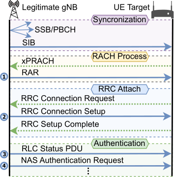
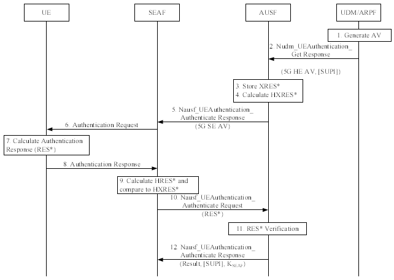
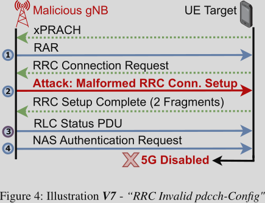
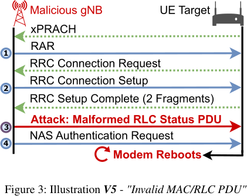

# 5Ghoul

## Background 

### 5G Cellular Architecture

- 3 Main Components:
    - gNB: gNodeB (Radio Access Network)
        - "Base Station" which handles the medium access procedures
    - UE: User Equipment
        - Phone with modem and SIM card
    - CN: Core Network
        - Backbone of the cellular network, that contains all the virtual functions
 
- 5G Standalone (SA) connection procedure with legitimate gNB and UE:

1. The gNB sends certain packets in short intervals to allow UEs to attach
    - SSB: Synchronization & Signal Block
        - Allows UEs to synchronize before initiating an attachment procedure
        - Broadcasted over the PBCH (Physical Broadcast Channel)
    - MIB: Master Information Block
        - Hold information on subcarrier spacing (SCS), control channel for SIB PDSCH etc.
    - SIB1: SystemControlBlockType1
        - Holds all information to allow the UE attachment of up to RRC Setup
    - **With all periodic information in place, the UE can start a "RACH process" (Random Access
    Channel), since it is synchronized on the down link (DL)**
2. The UE initiates the Random Access Procedure
    1. MSG1: Preamble Transmission
        - The UE sends a preamble to synchronize with the gNB
    2. MSG2: Random Access Response (RAR)
        - The gNB replies to the preamble by sending important information for UE
            - Timing Advance for synchronization adjustment based on the distance to the UE
            - Replying with the preamble ID to verify that the UE's sent preamble matches
            - Initial uplink grant: to allow the UE to to the RRC setup
    3. MSG3: PUSCH (Physical Uplink Shared Channel) message
        - The UE uses the grant it received before to perform the next step (RRC attachment)
3. The UE performs the RRC attachment
    - The UE sends an RrcRequest message
    - The gNB replies with a RrcReply (connection setup complete), aka *Contention Resolution* Message
        - Contains the UE's identity, and confirms that the gNB has correctly identified the UE
        - The UE receives a C-RNTI (Cell Radio Network Temporary Identifier)
4. The authentication flow starts the gNB requesting authentication from within the CN

## Methodology

- Hardcoding the protocol fields in the code (extracted manually from specification)
- Instrumenting OpenAirInterface 5G to send messages from the fuzzer to the target
- Reply is sent back to the gNB for verification

### Disadvantage

- Requires to have the gNB running during fuzzing, especially for verifying message flows
- Manual (and error-prone) work to implement the protocol fields for fuzzing

## Attacks 

It is important to note that the attacks are performing fuzzing and build up state in the target
basebands. This way, the detected vulnerabilities are more complex compared to fuzzing only one
task. This also yields a higher coverage of the functionality. Though, the authors cannot provide
any information on this.

