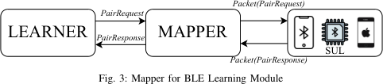

# BLEDiff - Noncompliance Checking for BLE Implementations

## Idea & Motivation

- Large and complex BLE specification - analogous to Cellular stack, which has the same problems
- Detects deviant behavior through differential testing of multiple devices
- Performs active automata learning, but for *each protocol* 
    - Construct an FSM for each sub-protocol
    - Identify the dependencies of the sub-protocols and compose them to a large protocol FSM

### Related Work on this field

- Hand-crafted bug oracles (sanitizers and specification)
- Reference state machines (either by protocol invocation)
- Reverse-engineering
- Manual effort to read the specification

## Approach

### Differential testing

- Exploit the fact that one implementation might be incorrect while the other is *different*
- At least one implementation is then considered incorrect - deviant

### Black Box Active Automata Learning

- Learner starts from a known initial state, sends a sequence of OTA messages to the device
- Automated FSM extraction of BLE-like human-in-the-loop protocols where human intervention (e.g.,
entering a passphrase aka., pass keys or checking numeric values at devices) is necessary, was not
explored before.
- Similar approach to "[Noncompliance as a deviant behavior](./non-compliance-as-a-behavior.md)"

#### Divide and Conquer Insight

NOTE: This is also applicable to Cellular Protocols - NAS/VoLTE/RRC/...

- Input messages for one sub-protocol does (usually) not influence the state of other
sub-protocols (after all they would probably be in one protocol then)

##### Division for BLE

1. Link Layer Control Protocol (LLC)
2. Security Manager Protocol (SMP)
3. BLE reconnection 

- Idea: learn the FSM for each one separately
- Termination of learning is considered, after the `Connected` state is reached
    - Depending on the analyzed protocol, this state is reached with different messages.

##### Conquering the implementation

- Merge the separate FSMs to create one protocol state machine
- The protocols arch chained together:
    1. The LLC protocol starts
    2. The SMP protocol is continues from the final "successfully terminating" state of the LLC and
       started there. 

## Challenges of active automata learning

### Scalability

- Large Input/Output alphabet
    - Must be designed and translated first - manually or from existing protocol definitions
- OTA messages are unreliable
- Learning takes days/weeks/months

#### Applying Optimizations

- Motivation: OTA Fuzzing is slow and unreliable
- In order to have more scalability, the usual optimizations (seen in [DIKEUE](./dikeue.md) are
applied:
    - Query caching: do not perform queries twice, if not needed.
    - Context Checker: Avoid OTA transmissions, by automatically ruling them out via invariants

#### Handling Reset, Human Interaction and BLE random addressing

- Reset must be transparent, and the replay must be deterministic for reliable learning
- Approach:
    - Set the passkeys to `0x000000`
    - Perform software resets (touch simulation on phones)

### Finding multiple Deviations

- DIKEUE: proposes *elimination-based* model modification
    - Deviation is removed from the model
    - However, this leads to having less deep introspection
- BLEDiff: Use a "refinement-based" model modification
    - Do not remove the transition, but instead refine it to be compliant between both FSMs
    - This way, the search can be continued - there still remain differences, it does **not** have
    an effect on the soundness of the model-checking!

## Evaluation

- The authors compared black-box fuzzing to BLEDiff and conformance testing to verify the coverage
of their approach. 
- NOTE: One can assume similar results for cellular, but with more coverage, when performing
coverage based fuzzing on top.

### Future Work

- Cross-sub protocol analysis. 
    - No modeling of cross sub-protocol interactions. 
    - There can be deviations where one sub-protocol affects others 
    - This is not modeled and kept for future work
