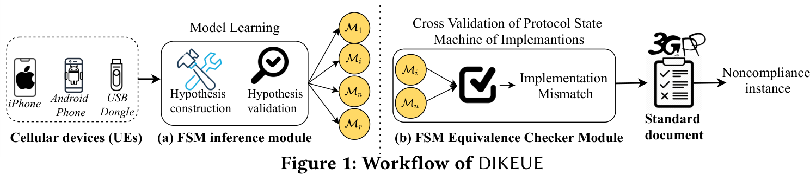

# DIKEUE: Noncompliance as Deviant Behavior: Black-Box Noncompliance Checker for LTE Devices

## Approach

- Automated Black-Box testing for LTE control plane implementations (L3)
- No direct checking of security properties - instead **differential testing**
- Finding Noncompliance in between instances (pairwise comparison)
    - Focus not directly on finding vulnerabilities - this follows more as a consequence of
    violating security properties

### Protocol learning Approach

1. **Active** black-box automata learning for I/O-state machine
2. Reduction to model-checking problem
3. Comparison of state automata to find discrepancies

#### Challenges

1. Cellular (LTE) is a multi-layer protocol (parsers for abstraction are required) 
2. Multiple timers and re-transmission counters
    - Might impede the automata-learning due to timing problems
3. Resetting the device transparently with HIL fuzzing is complex 
4. Learning does not only involve the "protocol", but also protocol bugs

### Implementation for Learner & Adapter

- Replace NAS and RRC messages from open source srsLTE to send crafted packets
- Transmission is performed OTA to the phone
- UE is reset in software

### Evaluation

> Some of these issues are only evident when the implementation reaches a specific state and can 
only be uncovered through stateful testing.

#### Challenge of Black-Box OTA Automata learning

1. Input and output alphabet must be constructed (protocol abstraction and parsing)
2. UEs must behave deterministically
    - Problematic in OTA setup; transmission errors etc. - hinders learning otherwise
    - Solution in paper: ask every query twice (inefficient!)
3. Membership queries must start from a common start state (reset of UE must be transparent)
    - No "snapshot", which guarantees that the protocol state is indeed captured
    - Solution in paper: Finding a software reset solution (still slow!)

#### Challenges in Learning Coverage and Termination

- Prune the number of symbols, that are not relevant for security dependent behavior
    - From 261 input messages - pruned to 35 (making the process more scalable)
- Context checker: remove queries for known invariant rules 
    - Assume for simplicity and scalability, that the UE does not violate a set of rules.
    - Disadvantage: This could also rule out messages, that are problematic for the modem!
    - Disadvantage: Adds a new layer of complexity in message handling to circumvent not asking the
      implementation.
- Caching of existing results - hit the cache first, then perform a slower query

#### Identifying Noncompliance from Protocol state machines

- Test two state machines differentially to find deviant behavior
- This is done via model-checking to find vulnerabilities *automatically*
    - After extraction of the FSMs, no more probing happens!

#### Triggering complex Protocol Interaction

- Some messages (e.g. messages related to mobility management) require physical movement
    - Handover cannot be tested easily
    - Solution in paper: Use specialized packets (e.g. `enable_tracking_area_update`) to circumvent
      movement and instead replay the messages that would be required.
        - Or send paging messages to simulate phone calls and bearer services

#### Resolving observational non-determinism with inconsistency resolvers

- Run the query twice to rule out inconsistencies
- If a mismatch is found - run one more time to perform a tie-break
- Disadvantage: Brings in factor 2 of slow-down, due to link nature

### Limitations

- False Negatives for five reasons:
    1. Pruning states and messages to decrease complexity
    2. Applying the "context checker" and removing infeasible but possibly vulnerable sequences
    3. Termination conditions for "accepted messages" are customized and manually/fixed (?) specified
    4. Disconnected FSMs in model checking
        - When a deviation is found, the FSM is pruned at this position, instead of being fixed (cf.
          [BLEDiff](./ble-diff.md))
        - This misses more vulnerabilities, which could be hidden in one protocol component
    5. Differential testing cannot find deviations, if both implementations deviate in the same way.

- No 5G application
    - To the time of writing, no srsRAN/OAI was available - thus testing was limited to LTE
    - Though, the ideas can be applied in the same way to 5G in future work
