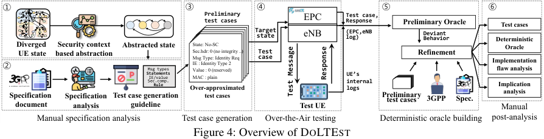

# DoLTEst

## Insight

- There are many approaches that use **positive tests** - "what should be accepted" as a base
- Rely on a small part of the specification which do not comprehensively cover all the test cases

- Missing component: **negative tests** - what should **not** be accepted?
- The previous works were not stateful - mainly focusing on parsing vulnerabilities

## Approach

### 1. Consultation of Specification

- Read the specification (manual effort)
- Define new "security-abstracted" states
- Construct guidelines - what should be accepted and rejected states

### 2. Generate test cases Guideline

- The focus was set to get an enumerable set of negative test cases
- Generated 1848 test cases which should not be accepted

### 3. Run the tests

- Use a test case and do deep state retrieval
- Run against a deterministic oracle to check the behavior

### Building a Deterministic Oracle

- First the assumption for every test case that is not part of the spec, that it should be
"silently" dropped - the UE should not reply to those messages

- **Case Analysis for deviations:**
    1. The UE returns a normal reply:
        - Either the UE has an implementation flaw
        - Or the message is an exceptional case in the specification, that was not modeled
            - The authors contacted 3GPP to clarify standard compliant behavior
    2. The UE returns a reject/error message:
        - Adjust state machine/model to include this in the state machine
            - The refinement assumes that this is the "right" behavior
            - All other devices have to abide to this
        - [!NOTE] This allows to perform device fingerprinting
    3. The UE does not reply:
        - Either it crashed or this is expected state
        - The authors evaluate this from the logs of the ADB console

## Evaluation 

- Evaluation of MTK, Qualcomm, Shannon - 43 devices
- Found 26 implementation flaws
- Logical bugs are harder to catch

### Ambiguities in the Specification

- The specification is ambiguous in several regards (`CounterCheck` messages, `IdentityRequest`, ...)
- Guaranteed deviations which allow fingerprinting of devices - launching attacks as a preparatory
step.
    - Implicit reject (drop) vs explicit rejects (message reply)
    -

## Disadvantages 

- Gets out of date - not a "one time effort"
- Limited set of tests: 1848 - coverage is limited
    - 
