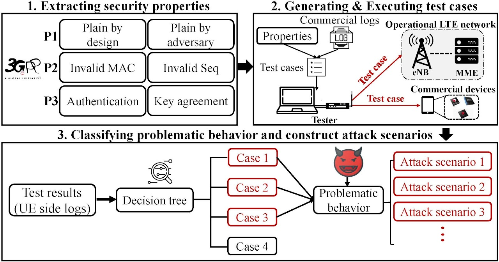
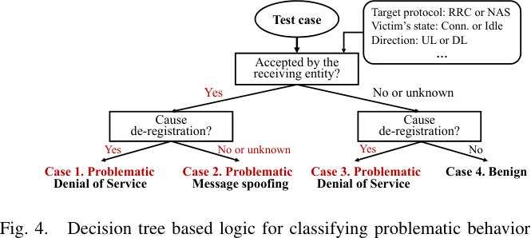
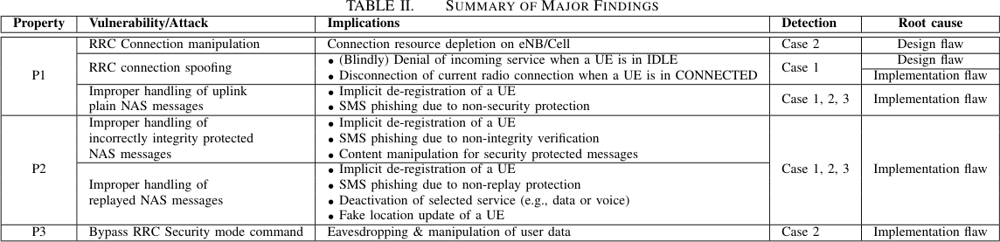

# LTEFuzz: Touching the Untouchables

## Approach

- Idea: Use an open source implementation to perform OTA Fuzzing
    1. Send dynamically generated test-cases to the target network/device
    2. Classify the response: is the behavior problematic or correctly handled?
    3. 

- Consisting of three main steps:

### 1. Extracting security properties

- Extraction of security policies for *control plane procedures* from the specification
- Analysis of procedures yields **three security properties**:
    - Must be fulfilled to protect against unknown security threats

> [!NOTE] This is equally relevant for our purposes!

- **Extracted Security Properties:**
    - Invalid plaintext messages must be handled correctly
        - Messages, that can be sent in plaintext
        - Messages that must not be sent in plaintext
    - Invalid security messages must be handled correctly
        - Invalid integrity protection
        - Invalid sequence number
    - Security procedures must not be bypassed
        - Mutual Authentication 
        - Key Agreement Procedure

### 2. Generating & Executing Test Cases

- Generated based on specified rules of target protocol messages and fields
- The corpus for fuzzing is using commercial control plane message logs

### 3. Classification of Problematic Behavior

- Classification of **UE logs**: 
   - Question: Is the behavior according to experienced behavior in the logs of the carriers?
- Method:
    - A) Send invalid input and stop if a valid reply is received: 
        - problematic, either because of achieving DoS
        - or because of spoofing capabilities with malformed messages
    - B) Send invalid input and verify whether the UE detaches
        - If it detaches, but the reply is not "expected" this is DoS
        - If it does not detach and the reply is not "expected" → Single correct message

## Evaluation

- Found categories of vulnerabilities:
   1. Unprotected initial procedures
   2. Crafted plain text requests
   3. Messages with invalid integrity protection
   4. Replayed messages (Re-ordering)
   5. Security procedure bypass

- Considered only bugs in the message handling of the core, not the parsing:
    - "The reason for only considering the inputs in the commercial logs is to prevent unexpected 
    crashes in the receiving nodes due to parsing errors."

- Wide-reaching impact:
    - Denial of service for arbitrary users (or single devices)
    - Spoofing for privacy leaks
    - Spoofed SMS
    - Eavesdropping and manipulation of data communication

- UE vulnerabilities were verified on Qualcomm basebands

> [!NOTE]
> Therefore, potential vulnerabilities in other states are not covered yet. We are currently 
> working to extend LTEFuzz so that it can uncover potential bugs in multiple state transitions 
> (i.e. stateful fuzzer).
