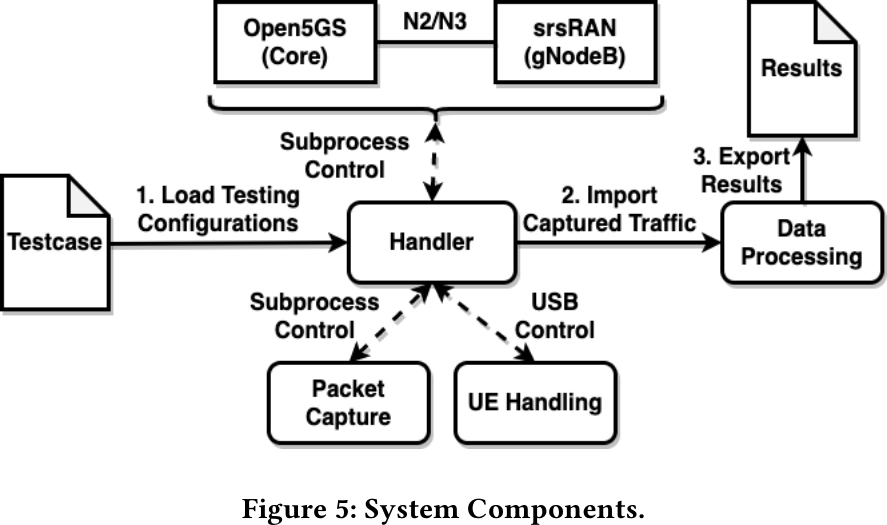
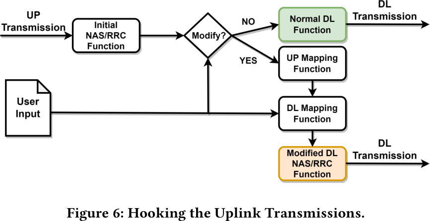

# UE Security Reloaded: Developing a 5G User-Side Testing Framework

NOTE: This paper has a **very good** overview of the protocol interactions on RRC/NAS and the
authentication flow!

## Motivations and Issues

- 5G SA software is developed currently and not very stable 
    - Connecting UEs is not necessarily reliable
- Software Control for security testing does not exist to the extent one wants
- No comprehensive test cases exist so far
- No automation, but manual analysis

## Design and Setup

### 5G Core and RAN

- srsRAN and open5GS are used for the gNodeB (RAN) and CN respectively
- They are orchestrated via a handler
- Configured with a Public Line Mobile Network Code (PLMN) -> MCC and 

### UE handling

- The tested phone is controlled via ADB
    - Allows to manage the device's network more fine-granular
    - The process is not fully automated (manual enablement of airplane mode)
        - Can be automated with rooting the phone

### Packet Capture

- Allows reading the network capture (`pcap`)
- The capture is analyzed during runtime - is the output expected?
- Also: Analysis in retrospect for a domain expert

### Test-Cases

There are two modes, in which the RRC (srsRAN) and the NAS (open5GS) can be adapted:

#### UL-DL Hooks

- Hooks for UL-DL - essentially hijacking uplink and down link
- The control is given on to the function, with the inputs, such that a correct output can be
produced

#### Control Plane Modifications
 
- Change the NAS handling (not RAN or User-Plane Function (UPF) specific)

### Evaluation of received Packets

- Three main categories for behavior are identified:
    1. Response status: Does the phone respond/crash/...?
    2. Specification compliance: Hard to verify...
    3. Security violation: Hard to verify...

- **Evaluation is a hard problem:**
    - No explicit description about guidance for complex test cases
    - Correct behavior is not directly specified
    - The specification is scattered across multiple documents
    - Result: manual inspection and domain expertise are required

## Evaluation of the framework

> NOTE: Additionally, the use of testing PLMN, i.e., 00101, should generally be avoided for
accurate results, because modems may enter into a debug mode and behave differently.

- Not all features are implemented in the frameworks (work-in-progress)
    - E.g. hand-over procedures
- Identifying technical issues is complex:
    - Requires debugging tools from manufacturers, which differ across implementations
