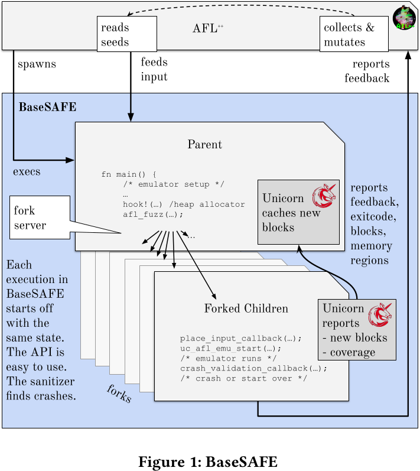

# BaseSAFE

## Approach

1. Extract a memory dump from a baseband
2. Re-host in QEMU:
    - Execute function to be fuzzed
    - Add hooks, whenever the allocator is called (sanitization of `malloc`/ `free` / ...)
        - "drop-in sanitizing heap allocator for Unicorn, which can replace any baseband-internal allocation mechanism to uncover heap corruptions and use-after-frees with fuzzing."
3. Run the fuzzing campaign with seeds
    - Hooks are required for two reasons:
        1. in order to place the input in memory (since we are working off a memory snapshot)
        2. in order to evaluate whether the baseband has crashed
4. For a found crash: use the `debug` mode to output the disassembled instructions and register values during execution

### Unicorn: Re-Hosting & Fuzzing

- Unicorn is a CPU emulator that executes the baseband firmware
- Allows for adding hooks to include more functionality
    - Used for Sanitization, Setup & Cleanup

### Parser-Identification

- Put a valid packet of type `x` into all functions and deduct which one is the correct parser, from code coverage
- Highest code coverage: most likely parser (and vice versa)

### Drop-In Heap-Sanitization

- Especially in a fuzzing, where the same test-case restarts over and over, "late" crashes due to MSV are hard to spot
    - The memory corruption and the late use of corrupted memory maybe far apart (not recorded)
- The drop-in allocator which hooks into the allocators, performs sanitization and can detect MSVs 
- All use-after-frees are detected due to sanitization
- NOTE: This is true for memory safety but also for overall state of the baseband - global variable state for example!
- NOTE: The authors do not employ memory snapshotting (but a forkserver which is the "initial snapshot")

## Initial Support

- Initially MediaTek was the only manufacturer that was initially supported
- The artifact repository contains also code for Shannon - extension!
- Focus on RRC and EMM messages for LTE (no 5G modems analyzed) - *Parsers were analyzed!*
    - "in particular, 3G [6] and LTE [3] RRC and NAS EMM [4, 5] messages"

> Even though there are compliance tests for the standards, these are developed 
> towards the interoperability among multiple vendors, not towards the implementation 
> problems of an individual baseband. The large amount of more than one thousand 
> different signaling messages for LTE RRC alone we were able to deduce through 
> fuzzing is likely not completely covered by compliance tests.

## Advantages

- Able to find memory safety violations (especially temporal)
- Fuzzes parsers without requiring full re-hosting

### Disadvantages

- False positives: the state is not complete - bugs may not translate to the taken snapshot
- A lot of manual effort involved to hook in to the allocator
- Significant slow-down due to hooks
