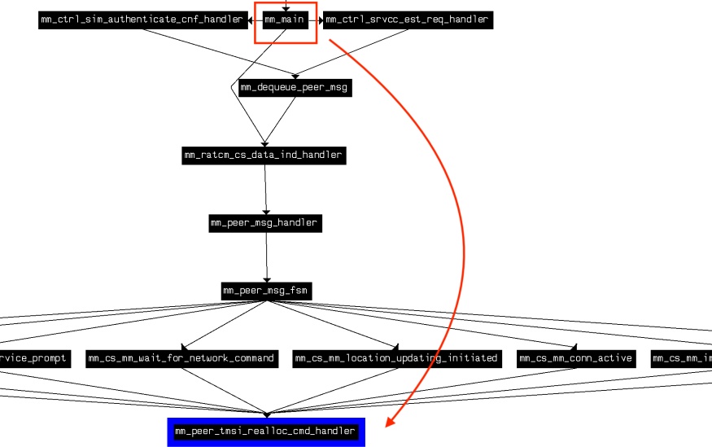
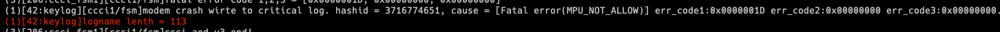

# Exploring the MediaTek Baseband

- KEEN Security Lab & Tencent Security Lab (Industrial)

- Main Attack Surface: Not only phones - 5G can be readily applied to other areas such as smart cars
- Ultra-Reliable Low-Latency Communications (URLLC): **Mission Critical** applications, that cannot afford delays and lack of reliability
- Massive Machine-to-Machine type communications (mMTC): Large networks of low power devices

## Approach

1. Extract the firmware from the device (rooted device - extract it from there)
2. Reversing of symbols (from debug file)
3. Find base in IDA
4. Extract call graph of message handlers
5. Fuzz the entry function (`mm_main`)

## Re-Hosting

- Write a C-Wrapper for the binary code
- Only calling into the main function and linking to provided APIs
- Use AFL QEMU for Fuzzing
- MIPS16e2 support was missing (they implemented it on their own but did not share it publicly)

