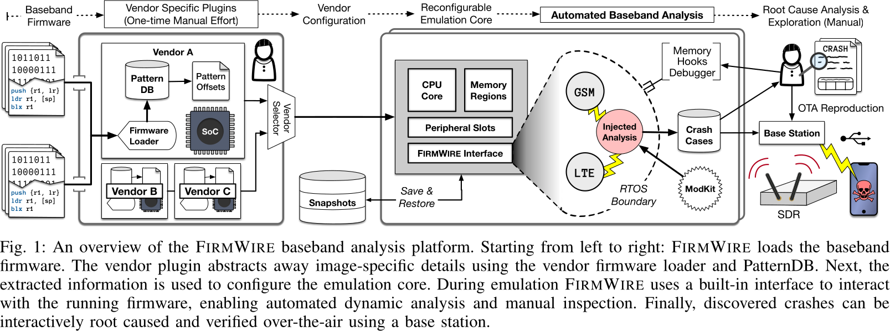
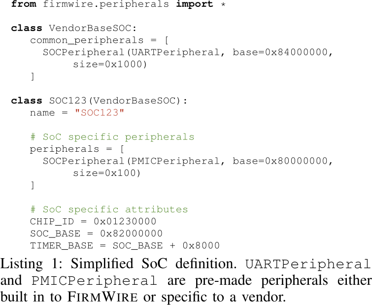
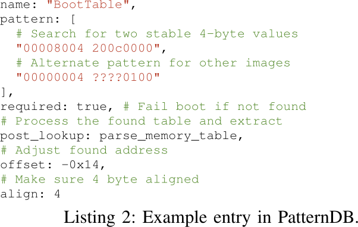

# FirmWire

## Motivation

- Basebands support a wide range of protocols from 2G to 5G 
    - this corresponds to at least 3 decades of support for cellular standards
- Basebands are susceptible to remote attacks and have a large OTA attack surface
- Existing research is quite limited: There is a lot of effort involved in manually reversing basebands
- Baseband attacks are practical as they are not seeing the same hardening as the mobile OSs (Android & iOS)
- Black-Box attacks do not provide an insight into the system's state: "Denial of service" could actually be a vulnerability
    - missing impact of interactions in basebands - what tasks to interact with each other?

## Targets

- 213 firmware images from 2 vendors across 9 phone models
- Protocol Stack: LTE & GSM
- Reproduced the bugs with OTA setup: base station & phones

## Background: Split between AP and BP

- Real-time demands of basebands are not compatible with the services of the AP
    - Complex protocols: ASN.1, CSN.1 and encapsulated protocols
- For this reason BPs are RTOSs' with independent tasks that perform protocol processing
    - Tasks mostly map to an individual protocol and interact with each other via well-defined APIs

## Design of FirmWire

Full-System emulation of basebands depending on the baseband vendor.

### Architecture

1. Firmware is loaded into the framework
2. Vendor plugin abstracts away vendor-specifics
    - Done using a PatternDB: find offsets of certain functions e.g. for startup (layout is known)
    - Goal: Find RTOS functions, data symbols across multiple revisions of a firmware
3. Execution of re-hosted firmware in the emulator
    - Using QEMU virtual devices that emulate on-chip periphery
4. Link to the detected symbols using *FirmWire API*
    - Exposes the RTOS API via this plugin
    - Offers rich debugging and introspection

#### Vendor Plugins

- Semi-Automated Effort: 
    - SoC selection: quirk handling
    - Memory Maps
- Extraction of headers: The file formats are same across multiple images

- SoC definition: 
    - Revisions change the memory layout
    - Time base addresses change, but exist in a similar layout

#### PatternDB

- What patterns are collected?
    - The currently running task ID
    - Error handlers etc.
- Can contain wildcards to be more robust against changes

- Require initial efforts to identify the functions: reverse-engineering

#### FirmWire Emulator

- Handles the execution of firmware, based on collectd information by the vendor plugin
    - Vendor plugin is an *API to the emulator*
- CPU configurations
    - Memory regions: what is MMIO?
    - Memory Segments/Pages: What is RWX?
    - Memory Contents: What is initialized/uninitialized garbage memory?

#### Peripheral Modeling

- *Problem*: Undocumented periphery is used
    - What hardware is behind `0xcafe`?
    - How does the device behave when getting an input of `0x01`?
    - Is it required to run the baseband actively, or only checked during boot (sanity check)?

- *Approach*: use simple peripheral devices to "pass the initialization"
    - reply with `0x01, 0x02, 0x03, ...` and observe the result
    - If not successful: use a REPL to manually learn the behavior

#### FirmWire Interface

- Using the PatternDB API for exposing internal baseband functions to the outside 
    - RTOS level functions, e.g. `switch task`, `list tasks`, `send message to task`
    - Passive monitoring of events, callbacks, ...
    - Emulation level API: `start, stop, write, read, snapshot, snapshotRestore`

#### Automated Analysis

- From inspecting and supporting the execution of basebands to testing baseband features
- *Baseband ModKit*:
    - Enables development and compilation of code and data that is injected into the baseband's memory
    - In the code artifacts: `modkit.ld` is the linker script that defines how the memory layout looks for a task
        - I.e. if a task is compiled, it will have exactly `0x1000 = 4kB` stack and obey to the set alignment of `16` Bytes
        - The modules are compiled in a "backward compatible way"
- *Guest Link (GLINK)*:
    - A debugging task that is injected into the task list and allows to perform bi-directional communication from outside
    - Advantage: Asynchronous interaction, that (should) does not interrupt the regular operation of the firmware

## Evaluation

- Security Analysis focuses on *Fuzz Testing*
    - Main application: Handling complex message handling 
    - Authors acknowledge that many dynamic analysis capabilities exist and fuzzing is *not* the only one
- Fuzzing Targets: Samsung Galaxy S8 to S10 (with ARM) and A41 (with MIPS)
- Campaign evalution metric: translated blocks in QEMU (with subsequent mapping in Ghidra)
- Methodology: "Similarly, our fuzzers found RRC-related crashes in all images except the G950 one (which has the least coverage)."
    - "This behavior could indicate a significant re-architecture of the targeted code or changes to existing branch conditions that are difficult to bypass with simple mutation-based fuzzing."

- Authors claim that coverage is "suprisingly low"
    - Reason: unauthenticated access decreases the attack surface to a smaller code proportion
    - Reason: complex state spaces are unexplored in the basebands - the operable initial state is selected for fuzzing
- Autors claim that **future work** is to perform "virtualized testing of baseband firmware [...] to improve generating inputs or new states that exercise deeper paths in the firmware."

### Comparison to State-Of-The-Art: BaseSAFE

- Higher Coverage in *some tasks*: In comparison to FirmWire, the manual BaseSAFE harness for CC achieves less coverage (19.71% vs 15.55%)
- Hihger Accuracy and reproducability: "In contrast, the automatically generated harnesses exercise more (CC & SM) or an equivalent amount of code (RRC) in the targeted tasks."
    - Fuzzing without full-system emulation mode achieves higher code coverage due to less CPU overhead. However, this comes at the cost of no longer having an accurate operating system model as task scheduling, timing, and messaging semantics no longer exist."
-  Less Effort for setup: Setup of an initial state vs. automatically generated harnesses in FirmWire

- *Conclusion*: FirmWire can even extend the framework of BaseSAFE and is not standalone.

### Discovered Vulnerabilities

- LTE RRC: **Malformed** `RRCConnectionReconfiguration` Message - leads to stack buffer overflow and RCE
    - Novelty: Vulnerability is **not** in the parser but in a re-encoding step
- LTE RRC: **Malformed** `MAC-MainConfig` in `RadioResourceConfigDedicated`
    - As above: re-encoding leads to heap buffer overflow
- LTE RRC: **Malformed** `RRCConnectionReconfiguration-v1250-IE` during RRC reconfiguration
    - As above: re-encoding leads to heap buffer overflow
- LTE RRC: **Double Free** for MCCH Messages
    - Same firmware as used in BaseSAFE, but the own allocator was used and detected a double free - crash with denial of service
- GPRS Session Management: **PDP Activation** - this is the bug from "A walk with Shannon"
    - Bug was found by specifically searching for the vulnerability
- CC: ASN.1 decode error & call setup heap overflow
    - Both vulnerabilities for GSM were **found in parsers** trusting the specification, but still using a TLV for length encoding

### Advantages

- Fast execution & time saving: 
> If an analyst were to try and find the flaws mentioned using over-the-air fuzzing alone, they would have to continuously initiate calls and GPRS activations to the device, with test rates close to 1 to 2 tests per minute.
> Additionally, due to the statefulness of the cellular protocols, physically resetting the device is necessary if internal state had been corrupted.

- Debugging and introspection make it more straightforward to understand the issues in the firmware
- Injection of tasks into the baseband possible

### Future Work

1. Support of Qualcomm modems missing - DSP ISA Hexagon not supported
    - NOTE: https://github.com/CUB3D/ghidra-plugin-hexagon-updated - apparently support for Qualcomm exists in Ghidra
    - NOTE: https://github.com/quic/qemu/releases/tag/hexagon-sysemu-04-oct-2024 - apparently support for Qualcomm exists in Qualcomm's downstream QEMU

2. 5G Basebands
    - Changes from Cortex-R to Cortex-A - which introduces an MMU and virtual memory

3. Run analysis with symbolic execution
    - authors created a proof of concept on top of angr
    - However, getting to the initialized state is a challenge (at least identifying it)

4. More interfaces:
    - "Basebands also have many other protocols, including GPS/GNSS, audio codecs, AT commands, diagnostic, and remote IPC."
    - NOTE: GPS might also have message parsing vulnerabilities, but no TLV messages, as the format is fixed in the specification.
    - NOTE: AT commands and remote IPC are stateful and viable targets (though AT commands are deprecated?)

