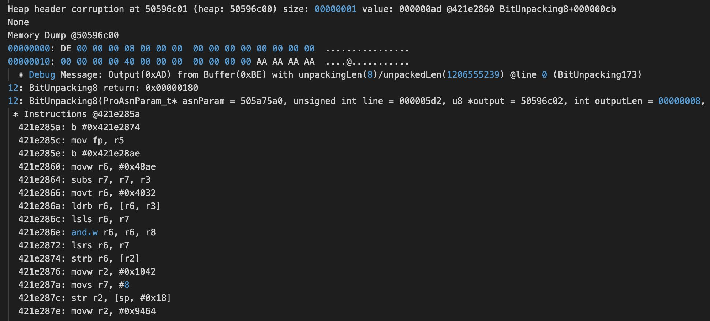
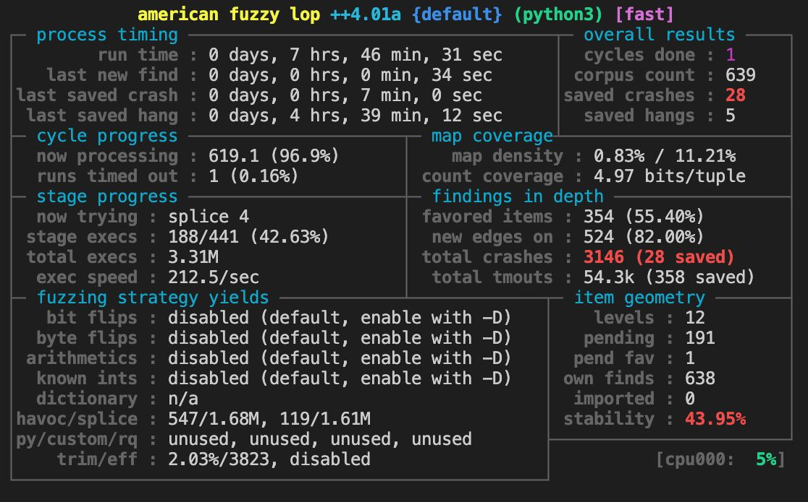

# Over The Air, Under The Radar

## Methodology

- Unicorn-based full-stack emulation: Supporting a Shannon Baseband (5123)
- Emulates Hardware layers
    - registers
    - PCIe interface
    - Flash memory (Remote File system)

- They use AFL++ for fuzzing and emulate ARM (no cross compilation)

- The explanation is very unclear!

## Targeted Components

- 2G Pre-AKA and Post-AKA
- ASN.1 and Low-Level Decoders
- 4G Pre-AKA

