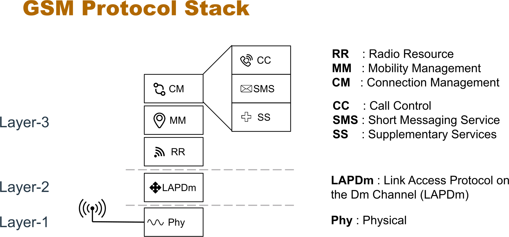
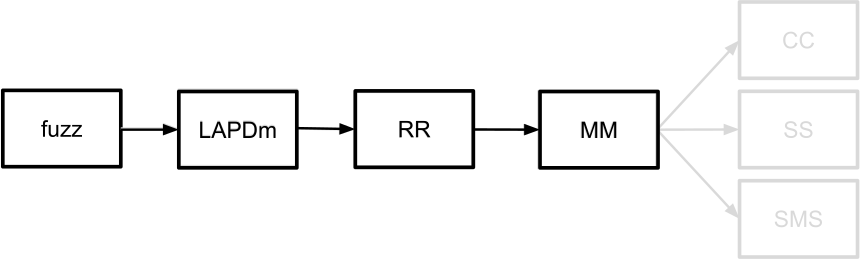

# Overcoming State: Finding Baseband Vulnerabilities by Fuzzing Layer-2

- Idea: Fuzz from the Layer 2 implementation
- This is the regular message flow when using the baseband (coming from the DSP)
- Having a setup for the L2 task, will then propagate to fuzzing the remaining part of the baseband

The fuzzer only has the "OTA" input, and not the tasks themselves: 

- However, doing this step requires some effort, since the protocol tasks are not properly set up:
    - It is a labor intensive task to perform state setup manually (reversing the code and finding out what values are required)
    - However, setting the state manually (or like in Marcel's talk via Fuzzing (?)) can be a viable approach to allow message submission
    - Also: use SIMurai for the same approach, but after authentication

## Recent defenses

- Pixel 8: Heap Sanitization (but this does still allow for DoS attacks!)
- Stack cookies
- More consistent and correct use of NX bits
- 2G is still supported, but from Android 12, it is "deprecated" - i.e. can be deactivated

## Future Work

- 3G to 5G: Not yet explored
- No automation in state setup
- OTA reproduction not easy because of missing `aarch64` support
