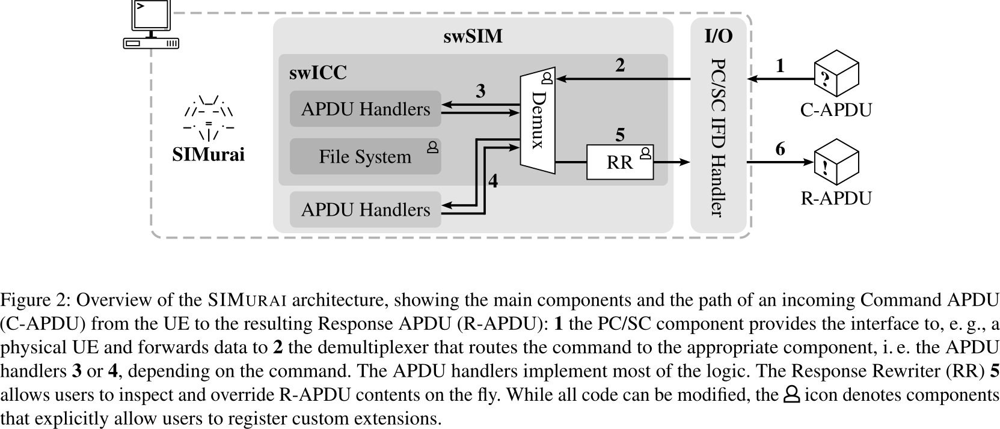

# SIMurai

- Considering a new attack vector for basebands:
    - Initially: Wireless medium (rouge base stations)
    - Later: The AP with shared memory and AT commands
    - The SIM Card (physical access)

- "At the same time, despite recent advances, security testing of baseband firmware remains a challenging and ongoing area of research (e. g. [24, 25, 31, 32, 34, 52])"
    - This is great to hear :)

- A SIM card is *a computer*
    - Runs a COS (Card OS)
    - Java Applets
    - can even open up TCP sockets and send SMSs

## Background on SIM Communication Protocols

- There is an application protocol between the UE (terminal) and the SIM.
    - Application Protocol Data Units (ADPUs) are sent from the terminal to the SIM and back (Command-ADPU -> ; Response-ADPU <-)
    - The ADPUs are *always* initiated by the terminal but there are *proactive commands* that enable the terminal to perform *proactive* commands

- Proactive commands are different from APDUs, but they remain feature-rich: 
    - for instance, they allow the SIM to display a menu, open the web browser, send an SMS message, or obtain the terminal location 

## Motivation

- Hostile SIMs are assumed to be part of the threat model for several reasons:

1. Attackers with physical access can install interposers (change communication between baseband and SIM) or "hostile SIMs"
2. Remote SIM administration can add new features to the SIM, with a remote update
    - Critical for rouge MNOs and compromised carriers
3. Supply-Chain attacks: access to the sim cards at any point in time during prodcution can be fatal
4. Vulnerabilities in the SIM software stack - use a vulnerable SIM for later attacks

## SIMurai Design

- swICC: emulated ICC that holds transport and application layers
    - does APDU processing
    - contains an FSM to simulate the behavior of a real ICC device 
    - has a `demux` component that allows to hook in new APDU handlers or use existing ones

- IO interface: middleware between a UE and the swSIM for C-APDU and R-APDU handling

## Evaluation

- Relevant: Integration with FirmWire
    - The authors were able to fuzz a baseband implementation (Shannon) by integrating SIMurai with FirmWire
    - This allows to re-host not only the Baseband functions but SIM specific features
    - The authors were able to find two critical issues in the Shannon baseband related to SIM proactive messages
