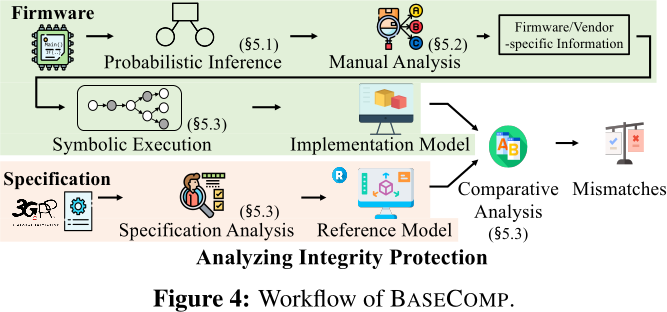
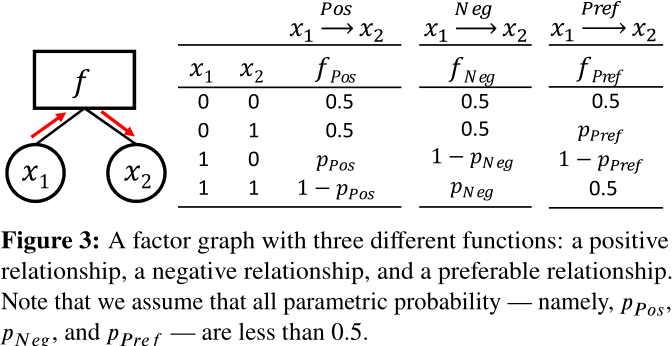
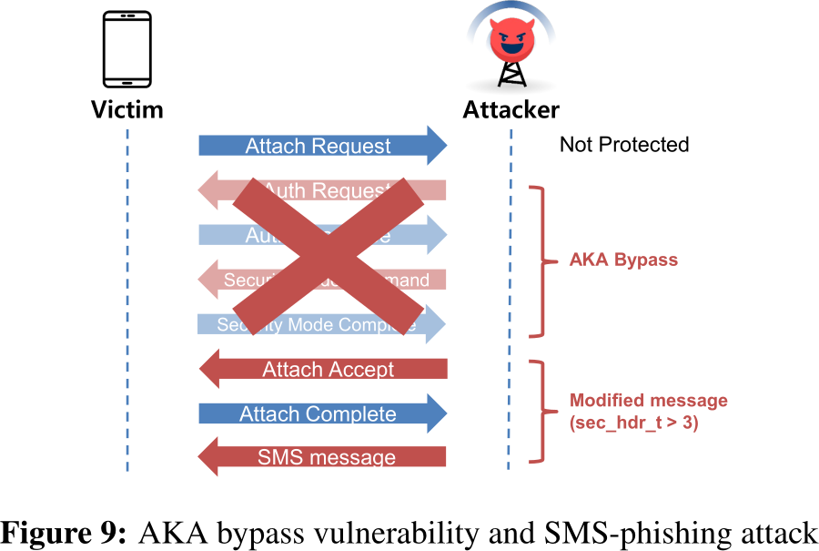

# BaseComp

## Motivation for Static Analysis

- Large Baseband Firmware
- Dynamic Testing is frequently used but does not cover a wide variety of tests
    - Syntactically broken messages can lead to issues
    - Unconsidered message (types)
- Requires domain specific knowledge

## Approach

### How are implementations probed/tested? 

1. Extract symbolic constraints from the specification:
    - What messages are allowed, and should be passed on by the basebands?
2. Compare the specification graph with the firmware's probabilistically identified graph.
    - The extracted graph from the specification is mapped to functions in the firmware binary.
    - The address in the binary is noted down - selected for further investigation
3. Perform symbolic execution on the extracted function and compare to the specification
    - This requires manual work to set up (how to symbolize function-parameters and returns)
    - Under-constrained symbolic execution: only the integrity protection function is analyzed

#### Factor Graphs

- In order to find the integrity protection function, the binary is scanned for this graph
- If a "matching" function is found, it is very likely to be the integrity protection function
    - It will then be selected for further investigation.
- The "ground truth" is the graph extracted from the specification

### How are security issues exploited?

- Changing messages: e.g. non-zero Security Header & missing authentication header 
    - "This also leads to Wireshark failing to parse such a message." (malformed)
- Adding security options that are mutually exclusive (wrong type for incorrect link (UL vs DL))

### Attack Targets

- *Cellular Protocols*:
    - EPS Mobility Management (EMM) protocol and its integrity protection
        - Reason: critical to cellular core network
        - Reason: includes complex logic - user identification, authentication, message encryption and integrity checks 
- *Basebands*:
    - Samsung and Mediatek (15) + srsRAN
    - Qualcomm not analyzed, as Hexagon is used: proprietary architecture without support from IDA/angr

### Advantages

- Finds logic bugs, since:
    1. They are reliably exploitable
    2. Cannot be mitigated
- This is a especially relevant for critical functionality of the baseband

### Drawbacks

- "To analyze integrity protection, BaseComp requires a reference model for integrity protection. Luckily, this model is relatively simple unlike its implementation; therefore, we build it manually based on the subclause 4.4.4.2 of TS 24.301 [3]."
    - The model has to be built manually, for comparison: This way there exists certainty about finding real issues.
    - Deriving a model is complex: "It is worth noting that we must consider implicit constraints from the subclause, such as the security state or security header type to analyze the baseband firmware."

## Evaluation

- Bugs were discovered in Samsung, MTK and srsRAN basebands
- Critical vulnerability: Non-Access-Stratum AKA Bypass

### Future Work & Discussion

- Semi-Automated approach:
    - Manual analysis required (e.g. for symbolic execution)
- Implementations do not fully map to factor graph
    - state variables are stored in global variables / contexts
    - The function looks a lot different in practice: replay protection, debuggin features, message-handling, ...
- Qualcomm is currently not supported 
    - IDA/Ghidra do not support Hexagon and VLIW instructions
    - Therefore: only integrity protection is regarded, which is a limited scope
