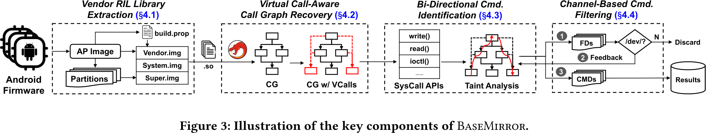
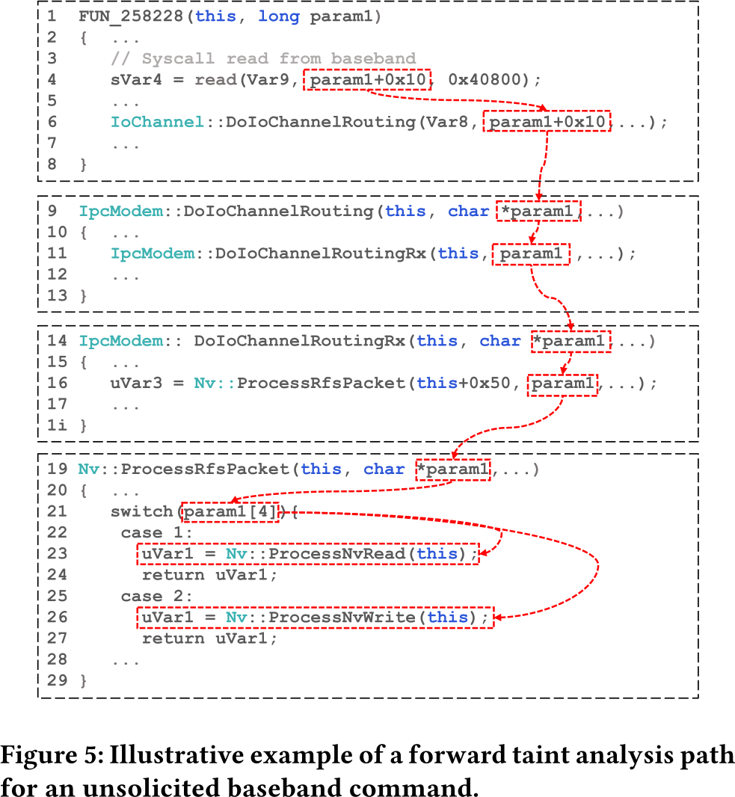
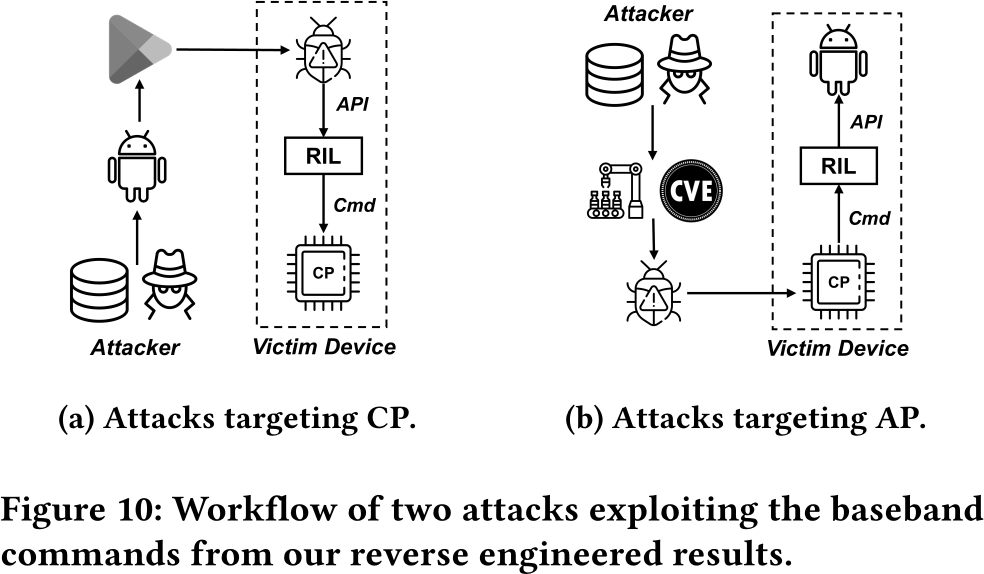

# BaseMirror

## Methodology

- Instead of analyzing the baseband firmware itself, BaseMirror reverses the Radio Interface Layer
(RIL) in the android user space.
- The rationale of this approach is, that the RIL is a *mirror* of the baseband interfaces, since
the interface from the (proprietary) RIL exists on the baseband
    - This approach has been applied to IoT and automotive before

### Arguments on the Attack Surface

- All communication between the AP and BP is mediated  by the RIL
    - HAL between radio hardware and operating system
    - Critical commands in the RIL expose exploitable attack surfaces targeting **both** AP and BP

### Approach

- Automatic static analysis on binary code
- Resolving virtual call targets and functions
- Use the fact that vendor RILs (extensions of the basic RIL) that use extensions of the basic RIL
must adhere to the AOSP-standardized RIL interface to ensurer compatibility with the generic RIL.

#### Objectives

- Analyze *solicited* and *unsolicited* Commands:
    - Unsolicited: Commands from the BP to the AP (notification mechanism)
    - Solicited: Commands from the AP to the BP (instruct the BP to execute functions)
    - **Task**: Identify the baseband commands from within the binary

- Recover virtual function calls
    - **Task**: Perform vtable resolution in static analysis for determining the interprocedural CFG
    - Find a way to recover the callers (taint analysis for backward propagation)

- Remove false positives and "undesired commands"
    - Read/Write System calls are not only used for interactions between AP and BP but also async
    communication, which must be accounted for in static analysis
    - Filtering by realizing that the reads/writes to the modem go to `/dev/xyz` devices (block
    devices), and not regular files

### Design and Implementation

1. Automatically extract the Android firmware and unpack the relevant RIL from the vendors
2. Disassemble the library and produce virtual-call-aware inter-procedural graph
3. Identify the solicited and unsolicited commands via taint analysis (from reads/writes)
4. Filter commands from the associated communication channel (is `/dev/xyz`?)

- Forward Taint Analysis: 
    - Start from read and follow the IPC calls
    - Dataflow analysis to the call targets

## Explored Attacks

- AP to BP (a):
    - Requires an application to invoke RIL calls
    - However, the android permission system prohibits access to this API as non `radio` group user
      or `root`
    - Therefore: considering `root` attacker or `system` apps
    - **Successful attacks:**   
        - Permanent service disruption (re-flashing the baseband required)
        - Recoverable crashes (require a re-boot)
        - Temporary disruption (few seconds) 

- BP to AP (b):
    - The baseband must already be compromised for this
    - Access to the file system on the AP, such as `ProcessNvWrite` and `ProcessNVRead`
        - For Samsung devices, this was reported as a backdoor (Replicant)
    - New vulnerability detected `Nv::ProcessOpenFile` - does not check symbolic links (arbitrary
    access)

