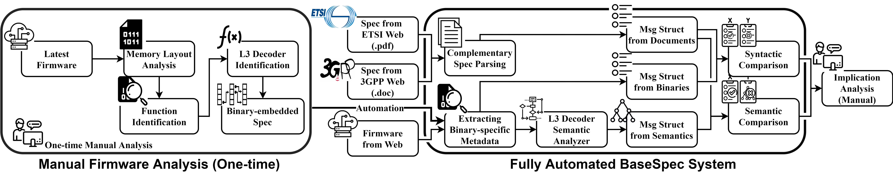
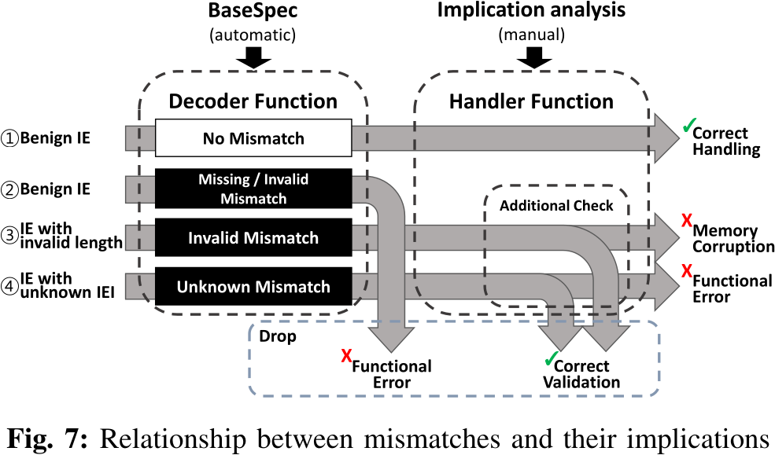
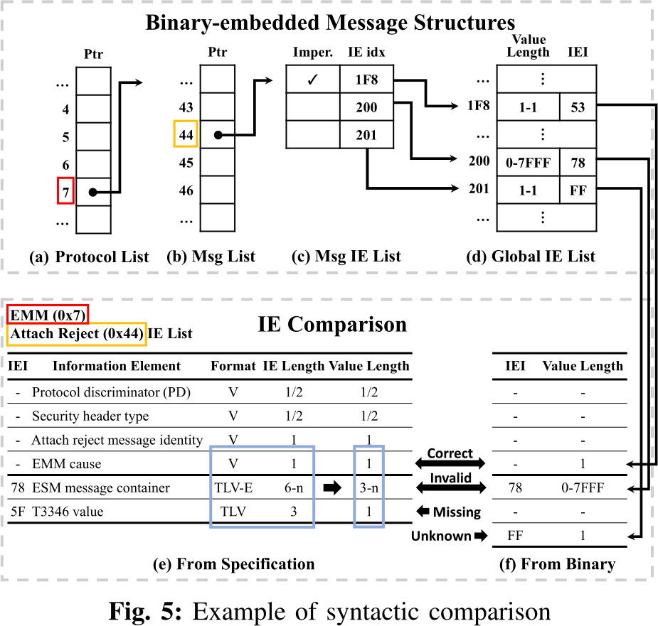

# BaseSPEC

## Approach

- Parse specification **and** baseband implementation data structures
- Compare the implemetation layout and try to find mismatches that are non-compliant with the specification

### Baseband part

1. Process the baseband firmware and extract strings
2. Process the specifcation and extract the specification messages
3. Compare both: implementation vs. specification
4. Manually verify the mismatches
    - They can be false positives due to changing format definitions
    - There might be invalid fields in the binary, which do not map to the specification or missing ones (incomplete)

## Evaluation

- False Positives for 2 reasons
    - limited support for angr in understanding ARM struct definitions
    - few binary-embedded messages have exceptional structures:
        - the specification did not "properly" list the IE, and instead pointed to another section - hard to parse

- Requires a lot of effort: many differences in the way messages are processed
- Adapting the process to a new vendor is a lot of effort

- A mismatch (even a true positive) does necessarily not correspond to a bug

- Lacking to include statefulness and other types of bugs - only syntatical, but no semantic bugs can be found
