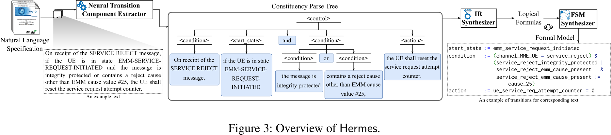

# Hermes

## Overall Idea

- Framework to generate a formal representation from the specification with a *constituency parser*
- Processing transition-relevant texts and components (states, conditions, actions)
- Design of domain-specific language, into which the logical formulas are translated

### Methodology

1. Hermes uses `NEUTREX` developed with a domain-knowledge-informed grammar
    - extracts portions of natural language text (states, conditions, actions)
    - can also determine logical relations of states and conditions
2. Hermes uses `IRSynthesizer` using a DSL and a neural dependency parser to identify key
   information, from the determined outputs of `NEUTREX`
    - converts conditions and actions to logical formulas (intermediate representation (IR))
    - can be converted to logical formulas that can later be translated to a formal language
3. Hermes uses `FSMSynthesizer` to combine logical formulas that correspond to transitions to create
   an FSM out of the previously identified IR

### Analyzed Protocols

- 4G and 5G NAS
- 5G RRC

### Evaluation Methodology

1. Perform model-checking on the generated FSM to find deviations, that were not designed
2. Compare Hermes-generated FSMs to "commercial FSMs"
    - Using [DIKEUE](../ota-fuzzing/dikeue.md) equivalence checking for the Model
    $M_{\text{Hermes}}$ and the vendor model $M_{\text{Vendor}}$
    - No vendors specified, but 9 were tested
    - No improvement over DIKEUE, since not all deviations are found and even false-positives have
    to be triaged.
