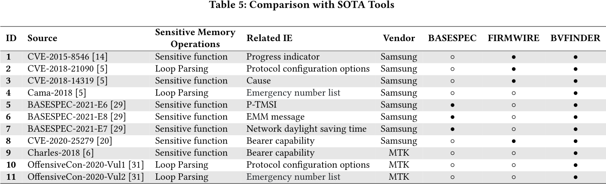

# Semantic-Enhanced Static Vulnerability Detection in Baseband Firmware

## Motivation

- Message processing (i.e. protocol specific handling) takes most of the code in the baseband
- Processing is understudied; instead the focus is on fuzzing parsers

- Message Processing is divided into two phases:
    1. message queues & parsing (common phase which has to be performed for all packets)
    2. management in message-specific semantics (protocol dependent)

## Empirical Bug Study

- Performed an empirical study over 9 years to find patterns in the vulnerabilities
    1. Many memory safety violations (e.g. buffer overflow)
    2. Pattern: attacker-controllable input + sensitive memory operation
    3. Strong locality to message-specific handling 

## High level Static-Analysis Approach

- Starting from the message specific phase (i.e. the message handling):
    1. Mark variables in decompiled binary, if they contain attacker-controllable input and have sensitive operations → "taint sources" 
    2. Determine the indirect callers of the tainted function → who calls the function in the CFG?
        - Observation 1: the variable that is tainted already gives away the caller and thus one can "easily" trace back the list of callers
            - Look for debugging strings: `CC -> ...` might indicate already the message type
        - Observation 2: Callers are often hardcoded into the binary - the caller-callee mapping can be determined via an inter-procedural data flow analysis
            - Use architecture specific information for caller-callee retrieval (ARM r0: contains return value)
    3. Construct payloads by finding message description in the 3GPP specification & matching them to the code locations (e.g. debug messages)

## Empirical Study of Message-Specific vulnerabilities

- Taking Qualcomm, MediaTek and Samsung as a reference (keywords: "modem", "baseband", "cellular")
- Time span: 2015 - 2024
- Vulnerabilities that are specifaclly for handling information element (IE) specific parts

- > [!NOTE] Validity is questionable since this is the information provided by the manufacturers and they generally don't acknowledge the types of vulnerabilities

## Evaluation

- FirmWire: found less than half of the vulnerabilities because **it is hard to create complex states, required for dynamically reaching these vulnerabilities**
    - "ID #7 vulnerability exists in the processing of "Network Daylight Saving Time" IE"
        - Requires establishment of NAS context - prefix of 10 more messages, which is quite challenging to be created by the coverage-guided fuzzing techniques
        - No cellular protocol knowledge applied
    - Improvement from BVFinder: No dynamic execution - logical bug tracing

- BaseSPEC: focus on common phase handling - i.e. specification message format etc.
    - Not comparable, as many bugs happen in the message specific phase and the parsers are mostly generated by now

### False Positives

- Omission of control flow guard conditions results from two types of inaccuracies in the detection process:
    - Checking inside loops only occurs for loop variables but not for variables that trigger conditional code
    - Static analysis is inherently leading to FPs

### Unexplored Attack Types

- NOTE: Memory Safetly is not the only attack to target (though it is easier to statically analyze)
- NOTE: Message Replay, Downgrade, IMSI catching - mostly logical issues of implementations

