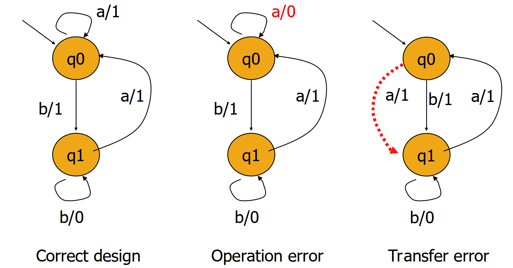

# Equivalence Checking

- Selecting the right test suite is a key skill in conformance testing
- Used to determine whether the implementation satisfies properties required by the specification
    - This is the actual problem statement of *equivalence checking*
- Finding the smallest set is the optimization problem that can be derived from the problem statement

## Context for Automata Learning

- The learner has derived a model, but in practice, verifying the conformance is not trivially
possible
- In order to verify the conformance of the hypothesis (an FSM) and the actual implementation, an
equivalence checking algorithm is used.
- Improving the hypothesis is done by:
    - (a) finding short counterexamples, if any exist
    - (b) using as few cycles as possible

## Methods for Equivalence Checking

- Distinguishing sequence method
    1. Check that each state defined in the specification exists in the system
    2. Check that all the edges in the specification conform

## Definitions

- $V$ is a set of input sequences:
- $S$ is the Mealy Machine for the specification
- $I$ is the Mealy Machine for the implementation

- $S_i$ and $I_k$ are $V$-equivalent, if they respond with the same output sequences for all input
sequences in $V$
- $S_i \simeq I_k$ if both states are $V$-equivalent for any two sets.

## W-Method

- The first algorithm that achieved systematic equivalence checking for mealy machines
- The $Wp$-method is an optimization of it, which requires less test cases and still provides the
same coverage.
- The assumption of the $W$-method is that the specification (hypothesis) is minimal
- Assuming **passive learning**: this requires exponential time, since DFA-minimization is an
NP-complete problem, that has to be solved before the equivalence can be determined

#### Steps of the algorithm

1. Estimate the maximum number of states $m$ in the correct implementation (if not known)
2. Construct the characterization set of $W$ for the given Mealy machine ("hypothesis")
3. Generate the prefix-closed set for the Mealy-machine (from the tree)
4. Construct the set $Z$ (the ????) from $W$ and $m$
5. Define the test set $T=P \cdot Z$

##### 1. Estimation of $m$

- $m$ is chosen under the assumption, that the implementation is known
- If this is not the case, one can:
    - (a) perform an educated guess
    - (b) assume $m = |Q|$

#### 2. Construction of the Characterization Set $W$

- Input sequences, that can distinguish between **all pairs of states**
- Consider: 
- This automaton has the set $W = \{*,/\}$ since we can distinguish all states with
those two sequences.
- For any two states $q_i, q_j \in Q$, the characterization set must contain a string $s$ such that,
  both state provide different outputs

To construct $W$:
- we have to construct a sequence of $k$-equivalence partitions of the state set $Q$.
- The sequence is $P_1, P_2, \ldots, P_m, m>0$

To find **a distinguishing word for each pair of states $q_i, q_j$**, we start from $P_m$ and see,
which state is added into the $m$-equivalence set. We can use the added sequences of length $m$ to
distinguish the other states to the $m$th state.

The idea is to repeat this process until we have a characterization set, which distinguishes all
states. It is also possible, that we end up earlier (prefixes of distinguishing words, might already
work for other states).

##### Computing $k$-equivalnece partitions

We consider the tabular representation of a mealy machine $M$ and establish the $1$-equivalence
partition:

We see that $P_1 = \{q_1, q_2, q_3\}$ and $P_2 = \{q_4, q_5\}$ are the partition for $k = 1$, since 
their outputs correspond. Consider that we **index** the partitions, and use them for distinguishing
now in step 2 for $2$-equivalence.

The new state names $q_{IJ}$ stand for the following:
- $I$: the state number, that is next ($q_1 -> a -> q_1$)
- $J$: the partition/group number of the state, that we consider ($q_1 -> b -> q_4$) and $q_4 \in
P_2$ thus, $J = 2$.

- For the new state, we actually only consider the partition ($k-1$-equivalence class) of it. If the
  equivalence class changes, we have a "new behavior"
- Thus, the 2-equivalence partitions are $P_1 = \{q_1,q2}, P_2 = \{ q_3\}, P_3 = \{ q_4, q_5 \}$

- Considering 3-equivalnece, we update the group numbers in the second index and find that $q_4$ and
  $q_5$ differ, since $q_4 -> a -> q_3$ and $q_5 -> a -> q_2$ and $q_3$ and $q_2$ are different.
- Thus, we can split them up into two partitions:

- We end up with $P_1 = \{ q_1, q_2 \}, P_2 = \{q_3 \}, P_3 = \{ q_4 \}, P_4 = \{q_5\}$

- Again we update the group numbers ($k-1$-equivalence classes) and find that $q_1$ and $q_2$ differ
  now for $b$:
    - $q_1$ goes into $P_3$ for $b$
    - $q_2$ goes into $P_4$ for $b$
    - Updating: $q_1$ and $q_2$ are split, and we terminate, since we cannot distinguish more that
    $m$ states.

If the Machine is minimal, we have only one state per equivalence class (Myhill-Nerode theorem)

###### Determine a distinguishing sequence for two arbitrary states from equivalence sets

- Assume: $q_1$ and $q_2$ from above
- We want to use the two tables, which change the partition between the two states
    - We have seen, that $b$ distinguishes them for $q_4$ and $q_5$ 
    - Now we consider $q_4$ and $q_5$, which got distinguished by $a$ for $q_3 \in P_1$ and $q_2 \in P_2$ 
        - For this reason we have $ba$
    - Now we backtrack again and try to find the difference between $q_3$ and $q_2$, which is both
    $a$ and $b$ (c.f. table 1) -> going to $q_5$ and $q_1$
        - For this reason we have $baa$ or $bab$
    - Finally, we distinguish $q_1$ and $q_5$ by Looking at the initial table 0 (the mealy automaton
      definition) -> We get  the difference in $a$
        - For this reason we have $baaa$ or $baba$

- Starting from the last state, we get all the other distinguishing sequences for "free"
- $W = \{baaa, aaa, aa, a\}$

#### 3. Construct the testing tree and the transition cover set $P$ of the tree

A testing tree is unrolling the DFA, but only when a new state is found.

This allows to construct the transition cover set $P$:
- It is a *prefix-closed-set*!
- But it is considered over the **testing tree* and not our initial automaton!

$P = \{\varepsilon, a, b, bb, ba, bab, baa, baab, baaa, baaa, baaab, baaaa\}$

#### 4. construct $Z$ from $W$ and $m$

- $Z = \Sigma^0 \cdot W \cup \Sigma^1 \cdot W \cup \dots \Sigma^{m - (n+1)} \cdot W \cup \Sigma^{m-n}\cdot W$
- Since we assume $m = n$ the set $Z$ is just $Z = \Sigma^0 \cdot W = W$

- If $n \neq m$, then we add all possible prefixes up to the length $\Sigma^{n-m}$, s.t. we make
sure that we find the differences, that cannot be determined with too few tests.

#### 5. Define the test set $T = P \cdot Z$

- Recall: 
    - $P$ was the prefix-closed set on the testing tree
    - $Z$ was the set of distinguishing sequences, that are derived for a machine with $m$ states
- Why?
    - When we compare the specification with the real implementation, we want to make sure that
    **all distinguishing prefixes** are valid, when starting from any point in the automaton.
        - The prefix-closed set of the testing tree guarantees, that we check every starting
        position
        - The set of distinguishing words guarantees, that we check the relevant words, which make a
          difference in terms of evaluation (there are infinite words, that cannot distinguish two
        states, we concentrate on those that do!)

## Targeted error types

- There are two types of errors that can exist:
    1. Operation errors: Producing different outputs, for the same input
    2. Transfer errors: Performing a wrong state-transition (output is correct though)
    3. Extra state error: An additional state, that changes the behavior (not minimal)
    4. Missing state error: Missing state, that does not account for existing behavior

- All these are covered by the $W$-method and valid
