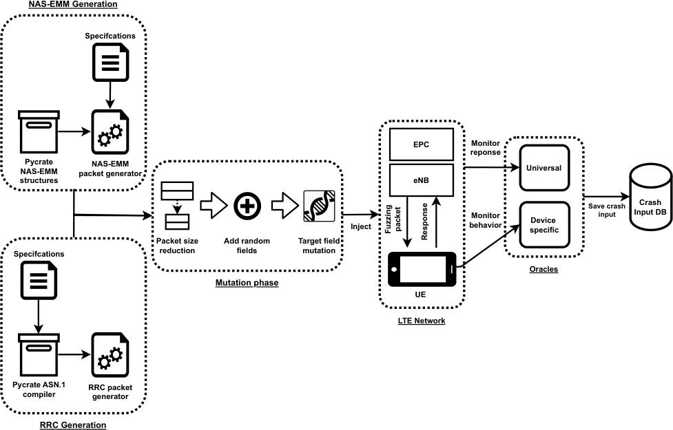
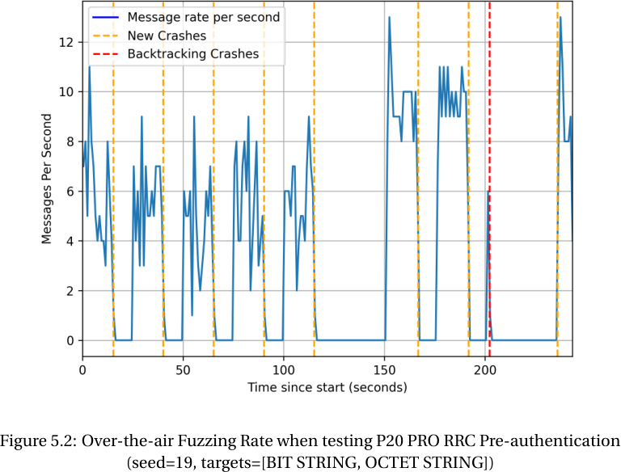

# Network Protocol Fuzzing

- Protocol is designed to allow communication parties to communicate with each other
- Fuzzing such an implementation is harder, because the protocol has deep code paths which would be
  hardly reached by a mutation-based greybox fuzzer

### Network Protocols are Stateful

- Many protocols have different stages
    - TCP: Connection establishment, Data Transfer, Connection Termination
    - TLS: 1.5-Way Handshake for authentication establishment

Prospex, Stateful Greybox fuzzing, IoTinfer: Auotmated BlackBox fuzz testing of IoT Network
Protocols Buided by Finite State Mahcine Inference

### OTAFuzz - Design

- HIL Fuzzing Approach (vendor independence)

#### Challenges

1. There is no coverage metric without introspection on memory state
    - Requires a new definition
2. OTA rate limiting & real-device entity impedes the efficient execution
    - Not *all* packets can be brute forced in a reasonable amount of time
- Grammar-aware fuzzing should uncover memory safety vulnerabilities
- There is a need for an *oracle* to determine, when a memory safety violation occured
    - HIL testing with basebands, does not allow introspection

#### System Overview

1. Packet generation & Mutation & Controller:
    - Packet Generation: use existing packet encoders/decoders to parse the packets
        - This is helpful, assuming that the vendors did implement the parsing correctly
    - Mutation: The packet in the end should still be valid and pass the parser → valid mutation
    - Controller: Sending over the messages to the OTA setup for OTA fuzzing

2. LTE Radio Access Network:
    - LTE software implementation for fuzzing payloads to the UE
    - Sends the payload over the RAN to the implementation → probing the baseband firmware
    - **Idea**: The fuzzing can happen:
        1. before authentication
        2. after successful authentication (more to do)
        - This allows to explore the implementation in greater depth

3. Oracle:
    - Multiple cases could have happened:
        - (a) the wireless link failed
        - (b) the implementation crashed
        - (c) some (recoverable) but undetected error occurred
    - **Detection**:
        - (a) using the "universal" reply indicator
        - (b) using the "device specific" log indicator
    - **Idea**: Maintain a log of the last $x$ packets sent to the UE
        - when the oracle kicks in, a backtracking takes place
        - last 5 payloads are sent 3 times after each other to determine the faulty packet

#### Tackling the Challenges

##### 1. Coverage Metrics

- Since the firmware is not known, the coverage cannot be extracted
- **Solution:** Coverage can be approximated, 
    - Leveraging the specification as a side-channel for the implementation

##### 2. OTA Packet Generation

- The specification imposes a maximum length of 2042 bytes for RRC packets and 2037 for NAS
    - However the OTA time for scheduling, resource allocation etc. is considerable
    - Remove non-target optional fields to reduce the set of packets
        - Target refers to the currently fuzzed field (IE) that is under investigation
    - The packets should all be valid, as there might be a parsing error, which is most-probably
    handled
        - Those packets are simply discarded and do not advance state

- The packets are mutated field by field 
    - Especially target fields with TLV (type, length, value)

##### 3. Oracle detection

- No memory inspection is possible
- **Solution**: Find indicators:

###### Universal Indicators

1. RRC ACK Timeout: If the baseband crashed, it is not replying in time
2. RRC Out-Of-Order ACK: Might be an indicator of a crashed modem (or a retransmission)
3. NAS Identity Requests: 
    - For NAS the *Identity Request* can be sent to find out the state of the UE NAS layer
    - The UE should reply with an *Identity Response*
    - Acts as a keep-alive message (ping)

###### Vendor Specific Indicators

1. ADB Logs: Grep for `CP Crash`
    - The message and output differs from vendor to vendor
    - E.g. when the modem reboots, some baseband prints `[Modem status: ONLINE]`
    - Not all baseband vendors log crashes
2. AT command interface
    - Only accessible as an interface on older phones
    - Acts as a keep-alive to find deviations
3. Telephony API
    - Android provides the telephony API to extract information from the baseband
    - Standardized way (e.g. RSSI signal strength)
    - Can also be used as a keep-alive indicator
4. Bluetooth API
    - Bluetooth is implemented on the same chip
    - Connecting a phone to a Bluetooth master and maintaining a heart-beat is a viable approach to
      monitor the state of the UE

### Implementation

- `Pycrate` for constructing messages: https://github.com/pycrate-org/pycrate
    - Serves as a generational-fuzzing framework
- LTE Implementation based off srsRAN LTE + srs LTE core network

### Limitations

- The auhtentication is hard to achieve on the OTA setup, because the UE has a back-off mechanism,
which requires manual authentication for reconnection
- Slow Performance: At most 12 packets per second, while the theoretical maximum is at 50/sec  

