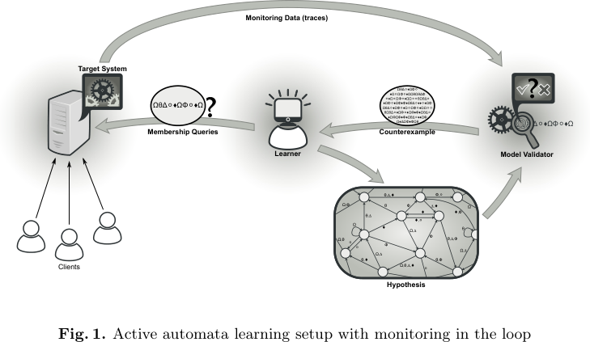
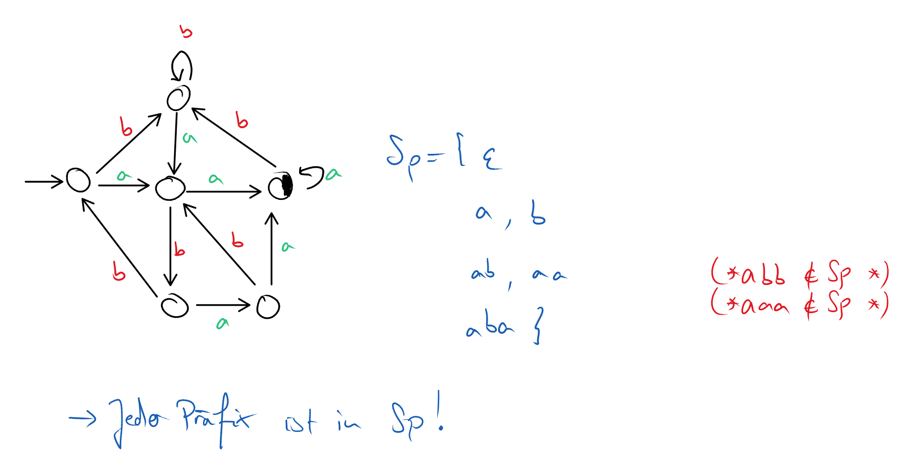
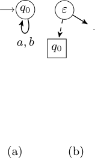

# TTT Algorithm: Redundancy Free Approach to Active Automata Learning

Active automata learning allows to obtain finite-state models approximat-
ing the runtime behavior of systems. These models are inferred by invoking
sequences of operations (so-called membership queries) on the system, and ob-
serving the system’s response. 

## Assumptions of Active Automata Learning

- Operations must be known a priori (public API/specification)
- Reactions of the system to a membership query must be observable
- System must behave deterministically

## TTT Algorithm

### Problem Statement

- Infer an unknown DFA $\mathcal{A}$ over the alphabet $\Sigma$
- The entity that performs the inference is called *learner*
    - There is a *teacher* that the learner can ask (aka Minimally Adequate Teacher (MAT))

- The learner can perform 2 types of queries
    1. Membership Query (MQ): Is $w \in \Sigma^*$
        - Asks the teacher to evaluate whether $\delta^{\mathcal{A}}(q,v) \in F$
    2. Equivalence Query (EQ): After the learner has conjectured a hypothesis DFA $\mathcal{H}$
        - The equivalence query returns either 'yes' or 'no' by presenting a certificate
        - The certificate is a counter-example: $w \in \Simga^*$ with $\delta^{\mathcal{H}}(q_0,w) 
        \not\in F^{\mathcal{H}}$
        - If a counter-example is found the learner has to refine the hypothesis
            - The subsequent hypothesis $\mathcal{H}'$ is then checked again 

### Preliminaries

#### Prefix-Closed Sets

- Algorithm maintains a "prefix-closed-set" $Sp \subset \Sigma^*$
    - Subset of words, such that every $u \in Sp$ represents one **unique** state in the hypothesis
      $\mathcal{H}$
        - Therefore, we call $u$ the **access sequence of $q$**, which we denote by
        $\floor{q}_{\mathcal{H}}$
    - **Prefix-closed** means that for every $u \in Sp$ also **all the prefixes** are in $Sp$

- To ensure that states are uniquely separated, distinct prefixes of $Sp$ must map to distinct
states of the target DFA $\mathcal{A}$
    - So for every pairwise different set of states $u, u' \in Sp$ there must be a suffix that 
    makes them "diverge", i.e. the states that $u$ and $u'$ denote, are really distinct!
        - We call this suffix, the *distinguishing **suffix*** which is able to do this for $u, u'$
    - All distinguishing suffixes are in the set $D \subset \Sigma^*$

- Having distinguishing suffixes for all $u, u' \in \Sigma^*$ allows us to imply that
$\mathcal{A}[u] \neq \mathcal{A}[u']$
- Together we get the set of state $mathcal{A}[Sp] = \{ \mathcal{A}[u]~|~u \in Sp\}$

> NOTE: The prefix-closed-set spans a spanning tree $Sp$!

> NOTE: There can be multiple correct prefix sets (not necessarily deterministic)
> But all prefix sets identify the same DFA
>  

#### Discrimination Trees

- A discrimination tree is a binary tree where inner nodes are $d \in D$, i.e. discriminators
- The leaf nodes of a discrimination tree are the **assumed nodes in the Hypothesis DFA**
$Q_{\mathcal{H}}$
    - Recall: The discriminators are used to test and separate states by appending them to input words 
    and querying the DFA to see which state each word corresponds to.

- In order to find out, the state that is mapped to a word, the **sifting** operation is performed
    - Start at the root (which has the $\varepsilon$ discriminator
        1. If $u\varepsilon \in A$ then take the "top"-branch (solid line/right)
        2. If $u\varepsilon \not\in A$, then take the "bot"-branch (dashed line/left)
    - This is performed with every inner node, until a leaf is reached
        - This leaf is the classified state of the hypothesis DFA

### Steps of TTT

#### Hypothesis Construction

- Recall: States are identified by *prefix-closed-sets* $Sp \subset \Sigma^$
- Every state (i.e. every word in $Sp$) corresponds to one leaf in the discrimination tree (DT)

- Assuming an existing set $Sp$ and a DT $T$, we construct a hypothesis as follows:
    - The initial state $q_0^{\mathcal{H}}$ is the empty word, which is always in $Sp$
    - Transition targets are determined with *sifting* $uc$, for $u \in Sp$ and $c \in Sigma$ into
    the DT $T$.
    - $q \in Q^{\mathcal{H}} is in $F^{\mathcal{H}}$ if it is in the $\top$-subtree of the root of
    $T$

- The initial hypothesis is $H_0$ where the $Sp = \{\varepsilon\}$, standing for the one state that
  has only self-loops for all $c \in \Sigma$.
    - The DT is therefore $\bot$ for all successors, since there is not a single accepted word, and
      all suffixes end up in $q_0$

#### Hypothesis Refinement

- The refinement only happens, if we have a **counter-example** that is presented
- We use *Rivest-&-Shapire*'s observation on counter-examples:
    - Let $w$ be a counter-example, i.e. $A[w] \neq H[w]$.
    - We can decompose $w$ into three parts: $w = u \cdot a \cdot v$
        - $u \in \Sigma^*$ is the prefix
        - $a \in \Sigma$ is a character of the alphabet
        - $v \in Sigma^*$ is the suffix

    - Since $A$ and $H$ differ, there must be a wrong assumption in $H$:
        - $\floor{u}_H
